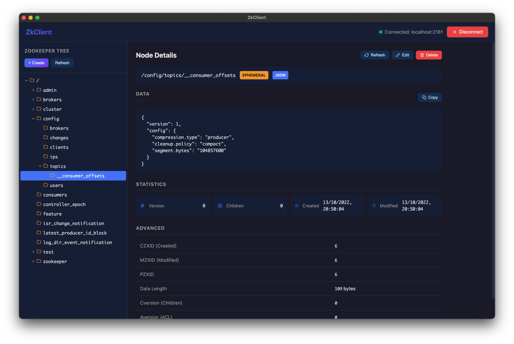

# ZkClient

A desktop application for managing and visualizing Apache ZooKeeper nodes, built with Electron and TypeScript.

## Screenshots


*Browse and manage ZooKeeper nodes with an intuitive tree view*

## Features

- Connect to local ZooKeeper servers
- Interactive tree view of ZK nodes with lazy loading
- View node details (data, statistics, timestamps)
- Create, edit, and delete nodes
- Support for ephemeral and sequential nodes
- JSON data detection and prettification
- Copy data to clipboard
- Dark themed modern UI

## Development

```bash
# Install dependencies
npm install

# Run in development mode (with hot reload)
npm run dev

# Build for production
npm run build
```

## Build for macOS

```bash
# Build .app (unpacked)
npm run build && npx electron-builder --mac
```

The `.app` will be output to `dist/mac-arm64/`.

## Build DMG for macOS

```bash
# Build .dmg (installer)
npm run build && npx electron-builder --mac dmg
```

The `.dmg` will be output to `dist/`.

## Build for Windows

```bash
npm run build && npx electron-builder --win
```

## Build for Linux

```bash
npm run build && npx electron-builder --linux
```

## Usage

1. Enter your ZooKeeper connection string (default: `localhost:2181`)
2. Click **Connect**
3. Browse nodes in the tree view
4. Click on a node to view its details
5. Use **Create** to add new nodes, **Edit** to modify data, **Delete** to remove nodes